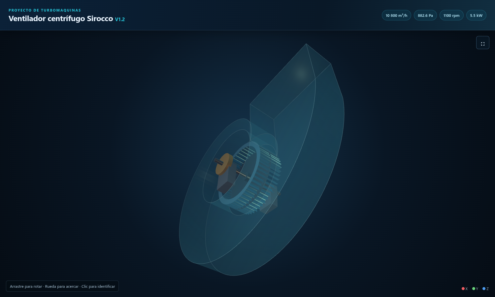
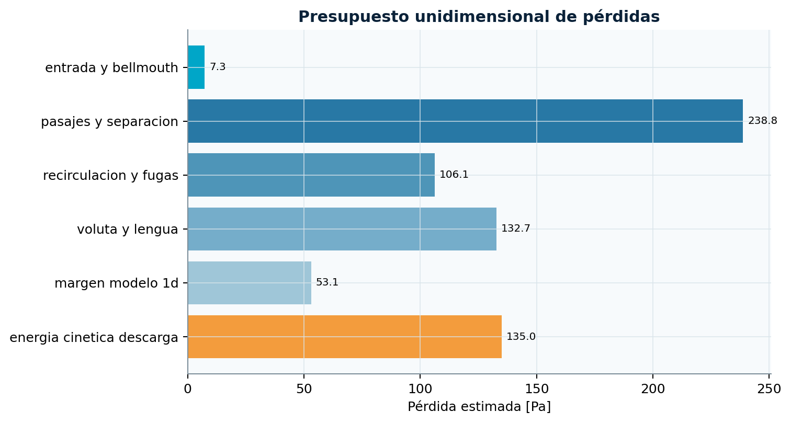
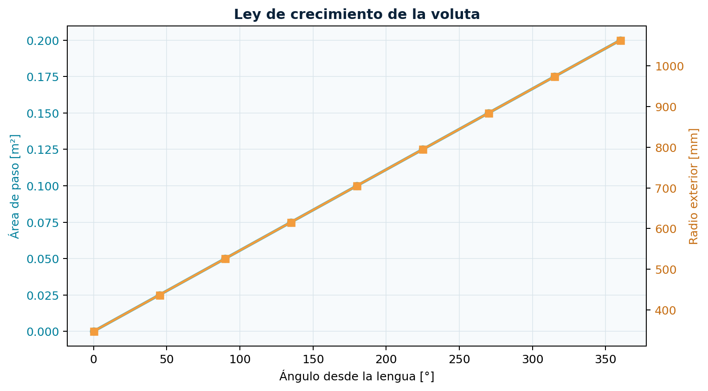
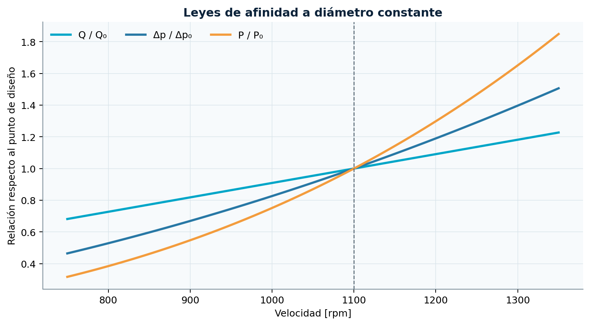
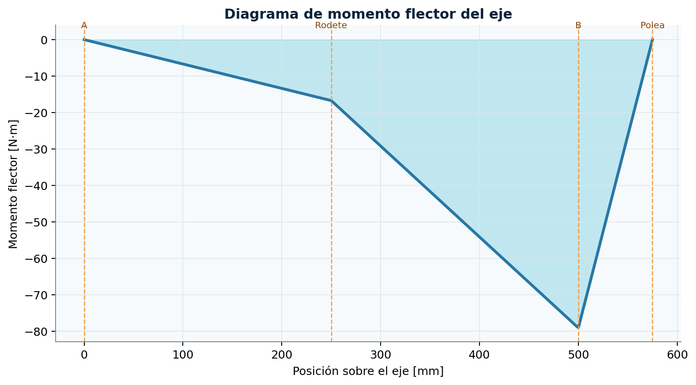
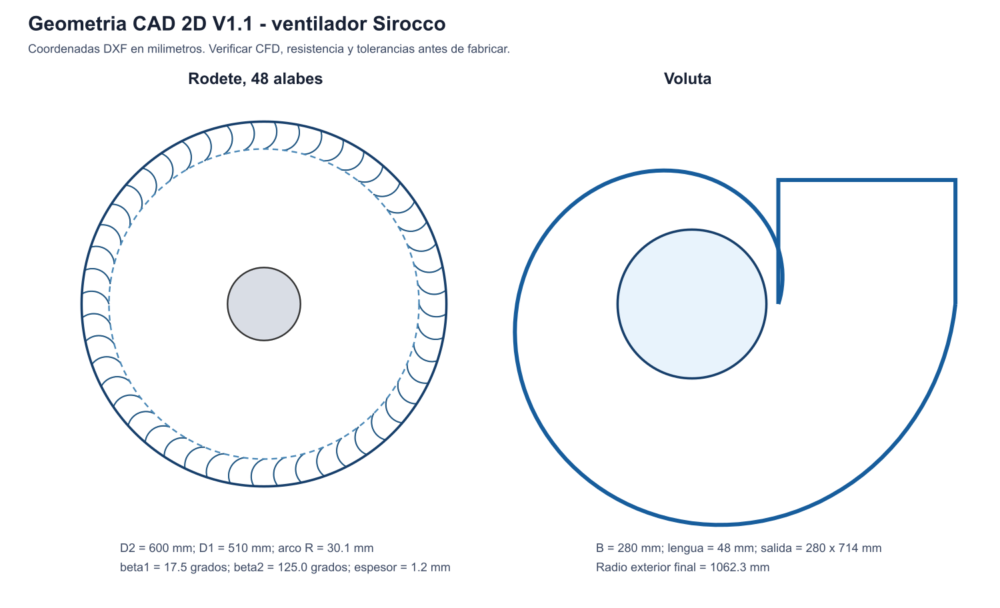
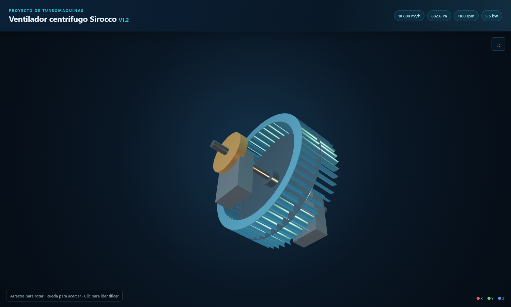
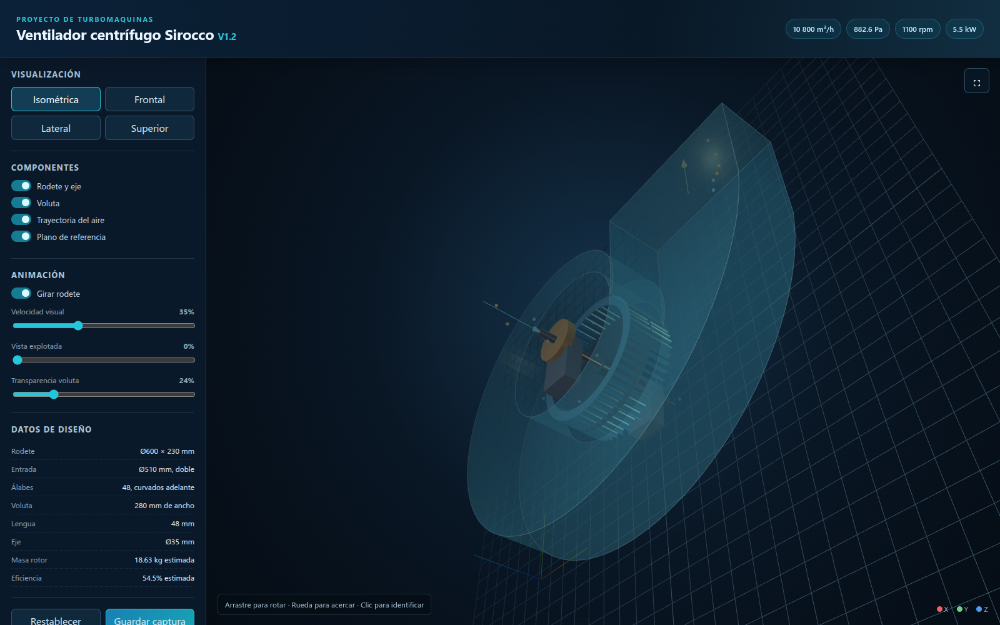

<div class="cover">
  <p class="cover-kicker">PROYECTO DE TURBOMÁQUINAS · GRUPO 2</p>
  <h1>Manual integral del diseño del ventilador centrífugo Sirocco</h1>
  <p class="cover-subtitle">Documentación por carpetas, ecuaciones, resultados, planos, modelo 3D, software e informe técnico</p>
  
  <div class="cover-data">
    <span>10 800 m³/h</span><span>882.6 Pa</span><span>1100 rpm</span><span>5.5 kW</span>
  </div>
  <p class="cover-school"><b>Universidad Nacional del Altiplano</b><br>
  Curso: Turbomáquinas · Docente: Ing. Armando Cruz Cabrera<br><br>
  Dilmar Humberto Siguayro Coila · Aquiles Taylor Ramos Yapo<br>
  Renzo Gabriel Mamani Galindo · Martin Calla Quispe · Abel Yovani Rivera Quispe<br><br>
  github.com/Aquiles-ryp360/diseno-ventilador-sirocco<br>
  Puno, 2026 · Revisión V1.2</p>
</div>

# Guía de lectura

Este manual explica cada carpeta del repositorio y reúne las ecuaciones usadas
en el predimensionamiento. La fuente vigente son los scripts Python, las
memorias de `06_calculos/` y los resultados generados. El diseño todavía
requiere CFD, análisis estructural, balanceo y ensayo antes de fabricar.

## Contenido

1. Gestión y planificación.
2. Bibliografía y estado del arte.
3. Avances académicos.
4. Cálculos aerodinámicos y mecánicos.
5. Planos y geometría CAD 2D.
6. Modelos 3D.
7. Software y pruebas.
8. Informe y figuras.
9. Interfaz gráfica offline.
10. Documentos originales del curso.
11. Informe LaTeX y presentación.

## Resultados principales

| Parámetro | Selección vigente |
|---|---:|
| Caudal | 3.0 m³/s = 10 800 m³/h |
| Presión estática | 90 mmH₂O = 882.6 Pa |
| Rodete | D2 600 mm, D1 510 mm, ancho 230 mm |
| Álabes | 48, curvados hacia adelante |
| Velocidad | 1100 rpm |
| Motor | 5.5 kW |
| Eje preliminar | 35 mm |
| Voluta | ancho 280 mm, descarga 280 × 714 mm |

<div class="page-break"></div>


# Documentación de `00_gestion`

## Propósito

Esta carpeta conserva la organización inicial del proyecto: diagnóstico de los
archivos recibidos, requisitos identificados, distribución de tareas y
cronograma. No contiene resultados de ingeniería que deban usarse para
fabricación.

## Archivos

### `diagnostico_carpeta.md`

Registra la revisión inicial del material del curso. Identifica el tema del
Grupo 2, los entregables solicitados y la información que faltaba al comenzar.
Sirve como evidencia de cómo se definió el alcance.

### `plan_trabajo_cronograma.md`

Organiza el proyecto en actividades: bibliografía, cálculo del rodete, voluta,
pérdidas, software, semejanza, CAD, validación y presentación. La ruta crítica
va desde el cierre del punto de diseño hasta la generación de geometría y la
validación.

## Cómo revisar esta carpeta

1. Leer primero `diagnostico_carpeta.md` para conocer el origen del encargo.
2. Comparar el cronograma con los entregables ya creados.
3. Actualizar estados y responsables cuando el equipo programe CFD, FEA o
   ensayos.

## Relación con otras carpetas

- Los requisitos originales se conservan en `2 diseño de turbomaquina/`.
- Los cálculos ejecutados están en `06_calculos/`.
- El software reproducible está en `08_software/`.
- La presentación final está en `09_reporte/` y `presentacion/`.

## Estado actual

El predimensionamiento, CAD 2D, modelo conceptual 3D, interfaz e informe ya
existen. Permanecen pendientes la simulación CFD, la verificación estructural,
los detalles de fabricación y el ensayo del prototipo.


<div class="page-break"></div>


# Documentación de `04_bibliografia`

## Propósito

Reunir las fuentes que sustentan el método de diseño y el trabajo futuro de
validación. La bibliografía se concentra en ventiladores centrífugos
multialabe, interacción rodete-voluta-lengua, CFD y optimización geométrica.

## Archivos

### `bibliografia_inicial.csv`

Base estructurada de artículos. Cada fila incluye tipo, título, autores, año,
DOI, fuente, resumen metodológico y aplicación al proyecto. Actualmente
contiene referencias de 2020 a 2026.

Campos principales:

- `doi`: identificador estable para localizar la publicación.
- `resumen_metodologia_resultados`: qué hizo el artículo y qué reportó.
- `aplicacion_al_proyecto`: por qué la fuente es relevante para el Sirocco.

### `estado_del_arte_preliminar.md`

Resume cinco líneas de investigación:

1. Interacción entre rodete, voluta y lengua.
2. CFD para validar diseños unidimensionales.
3. Optimización de ángulos, número de álabes y curvatura.
4. Métodos DOE, Taguchi y ANOVA.
5. Modelos a escala y prototipado.

## Cómo usar las referencias

- Las leyes de semejanza deben apoyarse en documentación técnica AMCA.
- La holgura de la lengua y el análisis de fluctuaciones deben justificarse con
  estudios específicos de ventiladores de álabes hacia adelante.
- La metodología CFD puede tomar referencias de OpenFOAM o ANSYS-CFX, pero las
  condiciones de frontera deben adaptarse al modelo de este proyecto.
- No copiar resultados de eficiencia de otros ventiladores como si fueran
  resultados propios.

## Criterio de citación

Toda afirmación externa debe incluir autor, año y DOI o URL. Los valores
calculados del proyecto deben citar el script o la memoria que los genera, no
un artículo externo.

## Pendientes

- Descargar y archivar las versiones permitidas de las fuentes principales.
- Completar lectura crítica y extraer geometrías comparables.
- Añadir normas de ensayo, seguridad, balanceo y selección de rodamientos.


<div class="page-break"></div>


# Documentación de `05_avances`

## Propósito

Conservar borradores y cortes parciales presentables durante el desarrollo.
Estos archivos muestran la evolución del diseño, pero no sustituyen la memoria
vigente de `06_calculos/`.

## Archivos

### `articulo_investigacion_borrador.md`

Borrador académico con autores, resumen, introducción, objetivos, metodología,
resultados preliminares, discusión, conclusiones y referencias. Es una base
editable para el artículo del curso.

### `avance_revision_docente.md`

Resumen corto preparado para revisión docente. Presenta el punto de diseño,
dimensiones seleccionadas y los cálculos principales de velocidad, presión y
potencia.

## Ecuaciones resumidas en los avances

```text
Δp = H · 9.80665
P_aire = Q · Δp
U₂ = π D₂ n / 60
C_m2 = Q / (π D₂ b k_b2)
Δp_Euler = ρ U₂ C_u2
P_eje = Q Δp_Euler / η_m
```

Los desarrollos completos, definición de variables y limitaciones están en
`06_calculos/DOCUMENTACION.md`.

## Precaución histórica

Si un avance contiene valores distintos, usar la revisión vigente:

- `1100 rpm`, no el tanteo inicial de `1500 rpm`.
- `D1 = 510 mm`, `D2 = 600 mm` y ancho `230 mm`.
- Eje mecánico preliminar de `35 mm`, no el mínimo torsional de `30 mm`.

## Uso recomendado

Actualizar estos borradores solamente después de regenerar los resultados con
los scripts. Para la exposición principal usar el PDF de `09_reporte/`.


<div class="page-break"></div>


# Documentación de `06_calculos`

## Propósito

Esta carpeta contiene la memoria técnica del predimensionamiento aerodinámico y
mecánico. Es la principal referencia para explicar qué se calculó, qué
ecuaciones se usaron, qué resultados se obtuvieron y qué hipótesis todavía
deben validarse.

## Punto de diseño vigente

| Magnitud | Símbolo | Valor |
|---|---:|---:|
| Caudal | `Q` | `3.0 m³/s = 10 800 m³/h` |
| Altura de presión | `H` | `90 mmH₂O` |
| Presión estática | `Δp_s` | `882.6 Pa` |
| Densidad del aire | `ρ` | `1.20 kg/m³` |
| Velocidad | `n` | `1100 rpm` |
| Diámetro exterior | `D2` | `0.600 m` |
| Diámetro de entrada | `D1` | `0.510 m` |
| Ancho de rodete | `b` | `0.230 m` |
| Número de álabes | `Z` | `48` |
| Espesor de álabe | `t` | `1.2 mm` |
| Ángulo de salida | `β2` | `125°` desde la tangente |

## Archivos principales

### `memoria_calculo_sirocco_v1.md`

Memoria aerodinámica vigente. Explica selección de doble entrada, triángulos de
velocidad, presión de Euler, potencia, voluta, pérdidas, semejanza y geometría
del álabe.

### `memoria_mecanica_sirocco_v1.md`

Memoria mecánica vigente. Explica masa, carga de correa, reacciones, flexión,
diámetro del eje, velocidad crítica y capacidad de rodamientos.

### `diseno_preliminar_sirocco.md`

Primer tanteo histórico. Contiene una propuesta a `1500 rpm` que fue descartada
al cerrar potencia y presión. No debe usarse como selección final.

## 1. Conversión de presión

La altura en milímetros de agua se convierte a presión mediante:

```text
Δp_s = H · 9.80665
Δp_s = 90 · 9.80665 = 882.5985 Pa
```

El factor `9.80665` convierte `mmH₂O` a pascales bajo gravedad estándar.

## 2. Potencia útil del aire

```text
P_aire = Q · Δp_s
P_aire = 3.0 · 882.5985 = 2647.8 W = 2.648 kW
```

Esta es la potencia útil entregada al aire. No incluye pérdidas aerodinámicas,
mecánicas ni de transmisión.

## 3. Área y velocidad en los ojos de entrada

El rodete es de doble entrada. El área total de los dos ojos, descontando el
cubo, se calcula como:

```text
A_ojos = N_e · (π/4) · (D1² - D_cubo²)
V_ojos = Q / A_ojos
```

Con `N_e = 2` y `D_cubo = 0.12 m`:

```text
A_ojos = 0.3859 m²
V_ojos = 7.77 m/s
```

## 4. Velocidad periférica

Para cualquier radio de cálculo:

```text
U = π D n / 60
```

Resultados:

```text
U1 = π · 0.510 · 1100 / 60 = 29.37 m/s
U2 = π · 0.600 · 1100 / 60 = 34.56 m/s
```

## 5. Factor de bloqueo por espesor

Los álabes ocupan parte del paso circunferencial. La fracción abierta se estima
mediante:

```text
k_b = 1 - Z t / (π D sin β)
```

Donde `β` se mide desde la tangente. Resultados:

- Entrada: `k_b1 = 0.880`.
- Salida: `k_b2 = 0.963`.

Esta corrección es geométrica y no representa por sí sola la capa límite ni la
estela real del álabe.

## 6. Velocidad meridional

```text
C_m = Q / (π D b k_b)
```

Resultados:

```text
C_m1 = 9.25 m/s
C_m2 = 7.19 m/s
```

## 7. Ángulo de entrada sin incidencia

Se supone que el aire entra sin componente tangencial apreciable. El ángulo de
entrada se obtiene de:

```text
β1 = atan(C_m1 / U1)
```

Como `C_m1` depende de `k_b1` y `k_b1` depende de `β1`, la ecuación se resuelve
iterativamente. El resultado es:

```text
β1 = 17.48°
```

Para geometría CAD se redondea a `17.5°` o `18°` según el nivel de detalle.

## 8. Factor de deslizamiento de Wiesner

La componente tangencial real se reduce por el número finito de álabes. Se usa
la estimación:

```text
σ = 1 - sqrt(sin β2) / Z^0.7
σ = 0.940
```

Su aplicación a un rodete Sirocco es una aproximación que debe contrastarse con
CFD o ensayo.

## 9. Componente tangencial de salida

```text
C_u2 = σ U2 - C_m2 / tan β2
```

Con álabes curvados hacia adelante y `β2 = 125°`:

```text
C_u2 = 37.51 m/s
```

## 10. Ecuación de Euler

La presión teórica transferida por el rodete se estima mediante:

```text
Δp_E = ρ (U2 C_u2 - U1 C_u1)
```

Suponiendo `C_u1 ≈ 0`:

```text
Δp_E = ρ U2 C_u2
Δp_E = 1.2 · 34.56 · 37.51 = 1555.5 Pa
```

La diferencia entre `1555.5 Pa` y la presión estática requerida de `882.6 Pa`
se interpreta como energía cinética y pérdidas internas del sistema.

## 11. Coeficientes adimensionales

```text
φ = C_m2 / U2 = 0.208
ψ_s = Δp_s / (ρ U2²) = 0.616
```

Estos coeficientes permiten comparar el punto con otras geometrías y aplicar
criterios de semejanza.

## 12. Potencia de Euler, potencia al eje y eficiencia

```text
P_Euler = Q · Δp_E = 4.666 kW
P_eje = P_Euler / η_m
P_eje = 4.666 / 0.96 = 4.861 kW
η_estática = P_aire / P_eje = 54.5 %
```

Se selecciona un motor de `5.5 kW`:

```text
Margen = P_motor / P_eje - 1 = 13.1 %
```

## 13. Razón para descartar 1500 rpm

Al aumentar la velocidad, la presión crece aproximadamente con `n²` y la
potencia con `n³`. El cálculo directo a `1500 rpm` entrega más de `8 kW` al eje,
superando el motor de `5.5 kW`. Por eso la revisión vigente usa `1100 rpm`.

## 14. Voluta y descarga

El área de salida se fija con la velocidad deseada:

```text
A_salida = Q / V_salida
A_salida = 3 / 15 = 0.200 m²
```

Con ancho interior `B = 0.280 m`:

```text
h_salida = A_salida / B
h_salida = 0.200 / 0.280 = 0.714 m
```

La descarga preliminar es `280 × 714 mm`.

## 15. Ley de área de la voluta

El caudal acumulado se aproxima linealmente con el ángulo:

```text
A(θ) = A_salida · θ / 360°
```

La holgura de lengua es:

```text
g = 0.08 D2 = 0.048 m
```

El radio exterior se obtiene de:

```text
R_ext(θ) = D2/2 + g + A(θ)/B
```

Por ello el radio crece desde `0.348 m` en la lengua hasta `1.062 m` al
completar la espiral.

## 16. Presupuesto de pérdidas

La diferencia de presión es:

```text
Δp_pérdidas = Δp_E - Δp_s = 672.9 Pa
```

Distribución preliminar:

| Componente | Pérdida |
|---|---:|
| Entrada y bellmouth | `7.3 Pa` |
| Pasajes, estela y separación | `238.8 Pa` |
| Recirculación y fugas | `106.1 Pa` |
| Voluta y lengua | `132.7 Pa` |
| Margen del modelo 1D | `53.1 Pa` |
| Energía cinética de descarga | `135.0 Pa` |

Las pérdidas de entrada y descarga usan presión dinámica:

```text
q_d = 0.5 ρ V²
```

El resto es un reparto de ingeniería para orientar la simulación, no una
medición experimental.

## 17. Torque del eje

```text
ω = 2πn / 60
T = P_eje / ω = 42.20 N·m
```

Para el tanteo torsional se usa factor de servicio `K_s = 1.5`:

```text
T_d = K_s T = 63.30 N·m
d_t = [16 T_d / (π τ_adm)]^(1/3)
```

Con `τ_adm = 30 MPa`, el diámetro matemático es `22.1 mm`. El redondeo
torsional inicial a `30 mm` no es la selección mecánica final.

## 18. Masa del rotor

Cada masa se calcula como:

```text
m = ρ_acero · volumen
```

Se suman álabes, dos anillos, disco central y cubo. Luego se aplica `8 %` por
soldaduras y refuerzos:

```text
m_rotor = 18.63 kg
W_rotor = m_rotor g ≈ 182.7 N
```

## 19. Carga radial de la correa

Para una polea de diámetro `D_p = 0.20 m`:

```text
F_t = 2T / D_p = 422 N
F_correa = 2.5 F_t = 1055 N
```

El factor `2.5` representa la relación preliminar entre carga radial total y
fuerza tangencial transmitida.

## 20. Reacciones y momento flector

Con apoyos separados por `L = 0.50 m`, rodete centrado en `x_r = 0.25 m` y
polea en `x_p = 0.575 m`:

```text
R_B = (W_rotor x_r + F_correa x_p) / L
R_A = W_rotor + F_correa - R_B
```

El diagrama de momentos se obtiene sumando las contribuciones de cada reacción
y carga según la posición. El máximo calculado es `79.0 N·m` junto al apoyo de
la polea.

## 21. Diámetro mecánico del eje

Se usa un momento equivalente tipo ASME:

```text
M_eq = sqrt[(K_b M_max)² + (K_t T)²]
d = [16 M_eq / (π τ_adm)]^(1/3)
```

Con `K_b = K_t = 1.5` se obtiene aproximadamente `28.4 mm`. Aplicando un factor
de `1.20` por chavetero y concentración de esfuerzos:

```text
d_corregido ≈ 34.1 mm
d_adoptado = 35 mm
```

## 22. Flecha y primera velocidad crítica

Para una carga central simplificada:

```text
I = π d⁴ / 64
δ = W_rotor L³ / (48 E I)
n_cr = (30/π) sqrt(g/δ)
```

Con `E = 200 GPa` y eje de `35 mm`:

```text
δ ≈ 0.032 mm
n_cr ≈ 5260 rpm
n_cr / n_operación ≈ 4.8
```

La verificación final debe incluir masa distribuida, polea, rigidez de soportes
y efectos giroscópicos.

## 23. Vida y capacidad del rodamiento

Para rodamientos de bolas se usa el exponente `p = 3`:

```text
L_10 = (C/P)^3 · 10⁶ revoluciones
C = P · (60 n L_h / 10⁶)^(1/3)
```

Con vida objetivo de `20 000 h`, la capacidad dinámica mínima calculada es
`14.3 kN`. La memoria recomienda seleccionar `C ≥ 20 kN` como margen inicial.

## 24. Fuerza centrífuga de un álabe

```text
F_c = m_álabe · ω² · r_medio
```

El resultado preliminar es aproximadamente `437 N` por álabe. Las uniones
soldadas todavía requieren FEA y verificación de fatiga.

## 25. Leyes de semejanza

Para dos ventiladores geométricamente semejantes:

```text
Q₂/Q₁ = (n₂/n₁)(D₂/D₁)³
Δp₂/Δp₁ = (n₂/n₁)²(D₂/D₁)²
P₂/P₁ = (n₂/n₁)³(D₂/D₁)⁵
```

Para escala `λ = 0.5`:

| Condición | rpm | Caudal | Presión | Potencia eje |
|---|---:|---:|---:|---:|
| Misma rpm | `1100` | `0.375 m³/s` | `220.6 Pa` | `0.152 kW` |
| Misma velocidad periférica | `2200` | `0.750 m³/s` | `882.6 Pa` | `1.215 kW` |

Debe revisarse también el número de Reynolds y las holguras relativas.

## Resultados generados

### `resultados_v1/`

- `resultado_completo.json`: todos los resultados aerodinámicos.
- `resumen_diseno.csv`: 29 variables resumidas.
- `tabla_voluta.csv`: 9 estaciones angulares.
- `presupuesto_perdidas.csv`: 6 componentes de pérdida.
- `semejanza_modelo.csv`: 2 condiciones a escala 1:2.
- `esquema_dimensional_sirocco.svg`: esquema visual.

### `resultados_mecanicos_v1/`

- `resultado_mecanico_v1.json`: masas, cargas, eje y rodamientos.

## Regeneración

```bash
python3 08_software/calculo_sirocco.py \
  --exportar 06_calculos/resultados_v1
python3 08_software/calculo_mecanico_sirocco.py \
  --salida 06_calculos/resultados_mecanicos_v1
```

## Limitaciones

- Modelo aerodinámico unidimensional.
- Factor de deslizamiento no calibrado para este rodete.
- Presupuesto de pérdidas asignado, no medido.
- Voluta de ley lineal sin optimización de lengua.
- Eje representado como viga simplificada.
- Sin FEA de álabes, disco, cubo o soldaduras.
- Sin curvas experimentales `Q-Δp`, potencia, eficiencia, ruido o vibración.


<div class="figure">

<p>Presupuesto unidimensional de pérdidas.</p>
</div>


<div class="figure">

<p>Crecimiento del área y radio de la voluta.</p>
</div>


<div class="figure">

<p>Leyes de afinidad a diámetro constante.</p>
</div>


<div class="figure">

<p>Momento flector preliminar del eje.</p>
</div>


<div class="page-break"></div>


# Documentación de `07_planos`

## Propósito

Contener la geometría bidimensional generada a partir del cálculo vigente. Los
archivos permiten revisar el perfil del álabe, la repetición de los 48 álabes y
la espiral preliminar de la voluta en programas CAD.

## Sistema de unidades y coordenadas

- Los archivos DXF usan milímetros.
- El eje del rodete está en `(0, 0)`.
- La geometría se dibuja en el plano `XY`.
- El eje axial y el ancho del rodete se incorporan posteriormente en 3D.

## Archivos

### `rodete_sirocco_v1.dxf`

DXF ASCII R12 con:

- Círculo de referencia `D2 = 600 mm`.
- Círculo de entrada `D1 = 510 mm`.
- Círculo de cubo de referencia.
- 48 contornos cerrados de álabe.

Capas principales: `D2_REFERENCIA`, `D1_REFERENCIA`, `CUBO_REFERENCIA` y
`ALABES`.

### `voluta_sirocco_v1.dxf`

Incluye el círculo de referencia del rodete, la polilínea exterior de la
voluta y las tres líneas de la descarga.

### `perfil_alabe_v1.csv`

Contiene 81 estaciones de la línea media del álabe: índice, `x`, `y`, radio
global y ángulo polar.

### `parametros_geometria_v1.json`

Parámetros exactos del arco circular:

- Radio de curvatura: `30.07 mm`.
- Centro: `(283.68, 9.04) mm`.
- Desfase polar de salida: `-3.15°`.
- Ángulos: `β1 = 17.5°`, `β2 = 125°`.

### Archivos SVG

- `geometria_cad_v1.svg`: revisión visual del rodete y la voluta.
- `esquema_dimensional_sirocco.svg`: dimensiones globales.

## Construcción del álabe

Se busca un arco circular que pase por los radios:

```text
r1 = D1/2 = 255 mm
r2 = D2/2 = 300 mm
```

y que tenga tangentes compatibles con `β1` y `β2`. El generador resuelve el
desfase angular `δ` imponiendo que el desplazamiento entre extremos y la
diferencia de normales sean colineales:

```text
cross(P2 - P1, n1 - n2) = 0
```

Después calcula el radio de curvatura y el centro. Los puntos del arco son:

```text
x(φ) = x_c + R_c cos φ
y(φ) = y_c + R_c sin φ
```

El contorno se obtiene con dos arcos concéntricos:

```text
R_exterior = R_c + t/2
R_interior = R_c - t/2
```

con `t = 1.2 mm`.

## Repetición circunferencial

Cada punto del álabe base se rota para `i = 0 ... 47`:

```text
α_i = 2π i / Z
x' = x cos α_i - y sin α_i
y' = x sin α_i + y cos α_i
```

## Construcción de la voluta

```text
A_salida = Q / V_salida
A(θ) = A_salida θ / 360°
R_ext(θ) = D2/2 + g + A(θ)/B
x = R_ext cos θ
y = R_ext sin θ
```

El perfil DXF usa una estación cada `2°`.

## Regeneración

```bash
python3 08_software/generar_geometria_cad.py --salida 07_planos
```

## Programas para abrir los archivos

- FreeCAD.
- LibreCAD.
- AutoCAD.
- SolidWorks mediante importación DXF.
- Navegador web para los SVG.
- Hoja de cálculo para el CSV.

## Límites de uso

Estos archivos son geometría conceptual. No incluyen tolerancias, dobleces,
radios de soldadura, espesores de carcasa, agujeros, chaveta, pernos, guardas,
acabados ni especificaciones de balanceo.


<div class="figure">

<p>Geometría CAD 2D del rodete y la voluta.</p>
</div>


<div class="page-break"></div>


# Documentación de `07_modelos_3d`

## Propósito

Contener los modelos conceptuales tridimensionales generados a partir de las
mismas dimensiones usadas en los cálculos y planos 2D.

## Archivos OBJ

| Archivo | Vértices | Caras | Contenido |
|---|---:|---:|---|
| `rodete_sirocco_v1_2.obj` | `11 570` | `16 248` | Álabes, anillos, disco, cubo, eje y polea |
| `voluta_sirocco_v1_2.obj` | `732` | `726` | Pasaje espiral y descarga |
| `conjunto_sirocco_v1_2.obj` | `12 302` | `16 974` | Rodete y voluta combinados |

Las unidades declaradas en los encabezados son milímetros.

## Archivos auxiliares

- `materiales_sirocco.mtl`: materiales y colores para visores OBJ.
- `modelo_sirocco_v1_2.json`: dimensiones, operación y coordenadas.
- `modelo_sirocco_v1_2.js`: mismos datos asignados a
  `window.SIROCCO_DATA` para abrir la interfaz sin servidor.

## Cómo se genera la malla

### Álabes

El contorno 2D de cada álabe se extruye entre:

```text
z0 = -b/2 = -115 mm
z1 = +b/2 = +115 mm
```

Cada lado del polígono produce una cara lateral y las tapas se triangulan desde
un centro geométrico. El álabe se repite 48 veces mediante rotación.

### Anillos, cubo, eje y polea

Se crean con cilindros sólidos o anulares discretizados en segmentos. El disco
central es un cilindro delgado y el eje usa el diámetro mecánico de `35 mm`.

### Voluta

Para cada estación angular se crean un radio interior fijo y un radio exterior
creciente:

```text
r_in = D2/2 + g
r_ext(i) = D2/2 + g + A_salida(i/N)/B
```

Las estaciones de ambas caras axiales se conectan con cuadriláteros.

## Cómo abrir los OBJ

- Blender: `File > Import > Wavefront (.obj)`.
- FreeCAD: `Archivo > Abrir` o importación de malla.
- MeshLab y visores OBJ compatibles.
- Interfaz incluida en `10_interfaz_3d/` para inspección directa.

Al importar, conservar unidades en milímetros y mantener el archivo MTL junto
a los OBJ para recuperar materiales.

## Regeneración

```bash
python3 08_software/generar_modelo_3d.py --salida 07_modelos_3d
```

## Alcance

Las mallas muestran la arquitectura y proporciones. No son sólidos
paramétricos de fabricación y no contienen tolerancias, soldaduras, tornillos,
espesor definitivo de carcasa ni detalles completos de rodamientos.


<div class="figure">

<p>Rodete de doble entrada, eje y polea.</p>
</div>


<div class="figure">

<p>Conjunto conceptual con carcasa espiral.</p>
</div>


<div class="page-break"></div>


# Documentación de `08_software`

## Propósito

Esta carpeta convierte el diseño en un proceso reproducible. Los scripts
calculan el punto aerodinámico y mecánico, generan geometría CAD y 3D, producen
el informe PDF y verifican resultados mediante pruebas automáticas.

## Requisitos

- Python 3.10 o superior.
- Biblioteca estándar para los cálculos, CSV, JSON, DXF y OBJ.
- `pytest` para pruebas.
- `matplotlib`, `numpy` y `reportlab` para generar el informe PDF.

## Scripts

### `calculo_sirocco.py`

Responsable del cálculo aerodinámico unidimensional.

Funciones importantes:

- `factor_bloqueo()`: fracción abierta del paso.
- `resolver_entrada_sin_incidencia()`: iteración de `β1`.
- `factor_deslizamiento_wiesner()`: corrección de salida.
- `tabla_voluta()`: ley de área y radio exterior.
- `semejanza()`: modelo a escala.
- `calcular()`: reúne presión, potencia, pérdidas, voluta y torsión.
- `exportar()`: crea CSV, JSON y SVG.

Uso:

```bash
python3 08_software/calculo_sirocco.py
python3 08_software/calculo_sirocco.py --json
python3 08_software/calculo_sirocco.py --caudal 3 --presion 90 --rpm 1100
python3 08_software/calculo_sirocco.py \
  --exportar 06_calculos/resultados_v1
```

### `calculo_mecanico_sirocco.py`

Calcula volumen y masa de piezas, torque, carga radial de correa, reacciones,
momento flector, diámetro ASME, flecha, velocidad crítica y capacidad dinámica
de rodamientos.

```bash
python3 08_software/calculo_mecanico_sirocco.py
```

### `generar_geometria_cad.py`

Resuelve un arco circular compatible con `D1`, `D2`, `β1` y `β2`; genera 48
contornos de álabe, la espiral de voluta y exporta DXF R12, CSV, JSON y SVG.

```bash
python3 08_software/generar_geometria_cad.py --salida 07_planos
```

### `generar_modelo_3d.py`

Extruye los contornos 2D, crea cilindros y la malla de voluta, y exporta OBJ,
MTL, JSON y JavaScript.

```bash
python3 08_software/generar_modelo_3d.py --salida 07_modelos_3d
```

### `generar_reporte_pdf.py`

Importa directamente los calculadores para evitar copiar números manualmente.
Genera gráficos de pérdidas, voluta, afinidad y momento; después crea el PDF A4
de 12 páginas y su resumen Markdown.

```bash
python3 08_software/generar_reporte_pdf.py
```

### `generar_manual_documentacion.py`

Reúne los archivos `DOCUMENTACION.md`, inserta las figuras técnicas, genera un
HTML con estilo y lo imprime como PDF mediante Chromium. También produce una
copia DOCX con Pandoc.

```bash
python3 08_software/generar_manual_documentacion.py
```

## Mapa de ecuaciones implementadas

| Tema | Ecuación principal | Script |
|---|---|---|
| Conversión de presión | `Δp = H·9.80665` | `calculo_sirocco.py` |
| Potencia útil | `P = QΔp` | `calculo_sirocco.py` |
| Velocidad periférica | `U = πDn/60` | `calculo_sirocco.py` |
| Bloqueo | `k_b = 1-Zt/(πD sinβ)` | `calculo_sirocco.py` |
| Flujo meridional | `C_m = Q/(πDbk_b)` | `calculo_sirocco.py` |
| Deslizamiento | `σ = 1-sqrt(sinβ2)/Z^0.7` | `calculo_sirocco.py` |
| Euler | `Δp_E = ρU2C_u2` | `calculo_sirocco.py` |
| Voluta | `A(θ)=A_s θ/360` | `calculo_sirocco.py` |
| Torque | `T=P/ω` | ambos calculadores |
| Eje | `d=[16M_eq/(πτ)]^(1/3)` | `calculo_mecanico_sirocco.py` |
| Velocidad crítica | `n_cr=(30/π)sqrt(g/δ)` | `calculo_mecanico_sirocco.py` |
| Rodamiento | `C=P(60nL_h/10⁶)^(1/3)` | `calculo_mecanico_sirocco.py` |
| Semejanza | `Q∝nD³`, `Δp∝n²D²`, `P∝n³D⁵` | `calculo_sirocco.py` |

La explicación completa está en `06_calculos/DOCUMENTACION.md`.

## Pruebas automáticas

La suite contiene 14 pruebas:

- Conversión de unidades y punto de operación.
- Cierre de presión, potencia y geometría.
- Crecimiento monótono de la voluta.
- Leyes de semejanza.
- Sobrecarga a `1500 rpm`.
- Masa, correa, flexión, eje y rodamientos.
- Radios y curvatura del álabe CAD.
- Archivos y tamaño mínimo de las mallas OBJ.
- Portabilidad y parámetros de la interfaz 3D.
- Existencia de documentación en todas las carpetas.
- Integridad básica del manual PDF consolidado.

Ejecutar:

```bash
python3 -m pytest -q 08_software
```

## Flujo completo de regeneración

```bash
python3 08_software/calculo_sirocco.py \
  --exportar 06_calculos/resultados_v1
python3 08_software/calculo_mecanico_sirocco.py \
  --salida 06_calculos/resultados_mecanicos_v1
python3 08_software/generar_geometria_cad.py --salida 07_planos
python3 08_software/generar_modelo_3d.py --salida 07_modelos_3d
python3 08_software/generar_reporte_pdf.py
python3 08_software/generar_manual_documentacion.py
python3 -m pytest -q 08_software
```

## Cómo modificar el diseño

Los valores base están en la clase `DatosDiseno`. Para cambios permanentes,
editar esa clase y regenerar todos los entregables. Para tanteos de caudal,
presión y rpm se pueden usar argumentos de línea de comandos.

Después de cualquier cambio debe revisarse:

1. Que el motor continúe superando la potencia calculada.
2. Que `β1`, bloqueo y velocidades permanezcan en rangos coherentes.
3. Que no se mezclen resultados de versiones diferentes.
4. Que todas las pruebas pasen.

## Limitaciones del software

No ejecuta CFD, FEA, optimización automática, selección comercial ni análisis
de ruido. Los resultados son predimensionamientos y geometría conceptual.


<div class="page-break"></div>


# Documentación de `09_reporte`

## Propósito

Contener el informe principal de presentación y las figuras que lo sustentan.
El PDF se genera desde los calculadores para mantener consistencia entre texto,
tablas y resultados.

## Informe principal

### `Informe_Diseno_Ventilador_Sirocco.pdf`

- Formato A4.
- 12 páginas.
- Incluye resumen, metodología, rodete, presión, pérdidas, potencia, voluta,
  mecánica, semejanza, interfaz 3D, archivos reproducibles, conclusiones y
  referencias.
- Punto vigente: `10 800 m³/h`, `882.6 Pa`, `1100 rpm`, motor `5.5 kW`.

### `Informe_Diseno_Ventilador_Sirocco.md`

Resumen textual del informe y enlace lógico con los entregables. No contiene
todo el desarrollo visual del PDF.

## Figuras

- `modelo_3d_rotor.png`: rodete, eje, polea y soportes.
- `modelo_3d_assembly.png`: conjunto con voluta.
- `interfaz_3d.png`: captura completa del visor.
- `geometria_cad_2d.png`: geometría de rodete y voluta.
- `perdidas_presion.png`: presupuesto de pérdidas.
- `ley_area_voluta.png`: área y radio frente al ángulo.
- `leyes_afinidad.png`: variación con rpm.
- `momento_flector.png`: diagrama del eje.

## Regeneración

```bash
python3 08_software/generar_reporte_pdf.py
```

El generador importa `calculo_sirocco.py` y `calculo_mecanico_sirocco.py`. Por
eso los cambios de diseño deben hacerse primero en los calculadores.

## Cómo revisar

1. Comprobar portada y nombres de integrantes.
2. Verificar que las tablas coincidan con `06_calculos/`.
3. Revisar que las imágenes no estén cortadas.
4. Confirmar que se mantenga la advertencia de diseño preliminar.
5. No presentar los resultados como ensayo o certificación.

## Documento recomendado para entregar

Usar este PDF como memoria principal. El PDF de `documento_latex/` es una
versión alternativa más breve y no incluye toda la revisión V1.2.


<div class="page-break"></div>


# Documentación de `10_interfaz_3d`

## Propósito

Proporcionar una interfaz gráfica para inspeccionar el ventilador sin instalar
un programa CAD. Todos los recursos están incluidos localmente y el visor puede
abrirse sin Internet.

## Inicio

### Windows

Desde la raíz del proyecto, ejecutar:

```text
ABRIR_MODELO_3D.bat
```

El BAT usa `%~dp0` para localizar la carpeta del proyecto y abre
`10_interfaz_3d/index.html` en el navegador predeterminado.

### Linux y macOS

Abrir `index.html` directamente con Chrome, Chromium, Edge, Firefox o Safari.

## Archivos

- `index.html`: estructura del panel y del área 3D.
- `styles.css`: diseño adaptable, colores y controles.
- `app.js`: escena, geometría, animación e interacción.
- `ABRIR_MODELO_3D.bat`: lanzador cuando se ejecuta desde esta carpeta.
- `vendor/`: Three.js y OrbitControls locales.

## Datos cargados

La interfaz lee `../07_modelos_3d/modelo_sirocco_v1_2.js`. Este archivo define
`window.SIROCCO_DATA` con dimensiones, punto de operación, perfil de álabe y
espiral de voluta.

## Construcción visual

- El álabe se crea como una forma extruida y se repite 48 veces.
- Anillos, disco, cubo, eje y polea se construyen con geometrías de Three.js.
- La voluta se crea como una forma extruida transparente.
- Flechas y partículas representan cualitativamente la dirección del aire.
- Soportes y rodamientos son elementos conceptuales para comprender el montaje.

## Controles

- Arrastrar: rotar la cámara.
- Rueda: acercar o alejar.
- Clic en un componente: mostrar su nombre.
- Vistas: isométrica, frontal, lateral y superior.
- Casillas: mostrar u ocultar rodete, voluta, flujo y rejilla.
- Velocidad visual: controlar la animación.
- Vista explotada: separar grupos para inspección.
- Transparencia: observar el rotor dentro de la carcasa.
- Guardar captura: descargar la vista en PNG.
- Pantalla completa: ampliar el área de trabajo.

## Portabilidad

Las rutas de scripts y estilos son relativas. Una prueba automática verifica
que no existan recursos `http://` o `https://`. Debe conservarse toda la
estructura del proyecto; si se separa el HTML de `vendor/` o de
`07_modelos_3d/`, dejará de cargar correctamente.

## Modos de captura del informe

Los parámetros `?report=rotor` y `?report=assembly` ocultan controles y ajustan
la cámara para generar figuras limpias del informe.

## Limitaciones

El visor no realiza CFD ni análisis estructural. Las flechas de aire son
ilustrativas, no líneas de corriente calculadas.


<div class="figure">

<p>Interfaz gráfica 3D autónoma.</p>
</div>


<div class="page-break"></div>


# Documentación de `1 artículo de investigación`

## Propósito

Conservar el documento original correspondiente al primer trabajo de
investigación del curso.

## Archivo

### `PRIMER_TRABAJO_DE_INVESTIGACION_U-1.docx`

Documento Word de aproximadamente 174 kB. El contenido está compuesto
principalmente por tres imágenes incrustadas, por lo que no se puede buscar ni
extraer el texto con fiabilidad. Debe abrirse visualmente en Microsoft Word,
LibreOffice Writer o Google Docs.

## Cómo revisarlo

1. Abrir el DOCX y comprobar las tres páginas o imágenes.
2. Identificar título, formato y requisitos de presentación.
3. Usar `05_avances/articulo_investigacion_borrador.md` como versión editable
   del contenido técnico del proyecto.

## Limitación

Este archivo es material de entrada. No contiene los cálculos reproducibles ni
los resultados vigentes del ventilador; estos se encuentran en `06_calculos/`
y `08_software/`.


<div class="page-break"></div>


# Documentación de `2 diseño de turbomaquina`

## Propósito

Conservar el enunciado original del trabajo de diseño asignado por el docente.

## Requisito del Grupo 2

El archivo `Trabajo_Diseno_turbomaquinas_26-I.docx` asigna:

- Tipo: ventilador Sirocco.
- Altura de presión: `H = 90 mm de agua`.
- Caudal: `Q = 3 m³/s`.
- Grupo: `Grupo 02`.
- Docente: Ing. Armando Cruz Cabrera.

## Entregables solicitados

El enunciado pide:

1. Cálculo del rodete.
2. Cálculo de la voluta.
3. Cálculo de pérdidas.
4. Desarrollo de software.
5. Construcción o propuesta mediante semejanza como modelo.
6. Entrega digital e impresa según la programación del curso.

## Trazabilidad

- Rodete, voluta, pérdidas y semejanza: `06_calculos/`.
- Software: `08_software/`.
- Planos: `07_planos/`.
- Modelo 3D: `07_modelos_3d/` y `10_interfaz_3d/`.
- Informe para presentar: `09_reporte/`.

Este documento define el problema; no es una memoria de cálculo.


<div class="page-break"></div>


# Documentación de `3 resolución de problemas`

## Propósito

Conservar el archivo del curso asociado a la resolución de problemas y a las
aclaraciones de entrega.

## Archivo

`Trabajo_Diseno_turbomaquinas_26-I.docx` es actualmente idéntico al documento
guardado en `2 diseño de turbomaquina/`. Incluye la lista de temas para los
grupos y las aclaraciones del docente.

## Contenido relevante para este proyecto

- Ventilador tipo Sirocco.
- `H = 90 mmH₂O`.
- `Q = 3 m³/s`.
- Cálculo de rodete, voluta y pérdidas.
- Proyección de software.
- Uso de semejanza para un modelo.

## Recomendación

Mantener esta copia como evidencia del enunciado. Si posteriormente se reciben
problemas numéricos independientes, agregarlos aquí con nombre, fecha,
desarrollo, unidades y respuesta verificada.


<div class="page-break"></div>


# Documentación de `documento_latex`

## Propósito

Conservar una versión alternativa del informe escrita en LaTeX.

## Archivos

### `reporte_diseno_sirocco.tex`

Fuente LaTeX con portada, índice, configuración seleccionada, geometría,
triángulo de velocidades, potencia, voluta, comparación de rpm y estructura del
repositorio.

### `reporte_diseno_sirocco.pdf`

Compilación A4 de 5 páginas. Es una memoria breve de revisión V1.

### `assets/sirocco_fan_render.jpg`

Imagen utilizada en materiales visuales.

## Ecuaciones incluidas

```text
U2 = π D2 n / 60
C_m2 = Q / (π D2 b k_b2)
σ = 1 - sqrt(sin β2) / Z^0.7
C_u2 = σ U2 - C_m2 cot β2
Δp_E = ρ U2 C_u2
```

## Compilación

Desde esta carpeta:

```bash
pdflatex reporte_diseno_sirocco.tex
pdflatex reporte_diseno_sirocco.tex
```

La segunda ejecución actualiza el índice y las referencias internas.

## Relación con el informe principal

El documento recomendado para presentar es
`09_reporte/Informe_Diseno_Ventilador_Sirocco.pdf`, porque incluye la revisión
mecánica, el modelo 3D y más figuras. Esta versión LaTeX puede mantenerse como
alternativa editable.


<div class="page-break"></div>


# Documentación de `presentacion`

## Propósito

Contener dos formas de exposición: una presentación web interactiva y un
archivo PowerPoint generado con Python.

## Presentación web

### Archivos

- `index.html`: siete secciones o diapositivas.
- `style.css`: tema oscuro y distribución visual.
- `script.js`: navegación, cálculo interactivo y dibujo SVG.

### Diapositivas

1. Portada.
2. Requerimientos de diseño.
3. Geometría del rotor.
4. Triángulo de velocidades interactivo.
5. Voluta y difusión.
6. Comparación de `1100 rpm` y `1500 rpm`.
7. Estructura del repositorio.

La calculadora visual permite modificar parámetros y redibujar el triángulo de
velocidades. Para valores oficiales deben usarse los scripts de
`08_software/`, no el cálculo del navegador.

## PowerPoint

### `presentacion_sirocco.pptx`

Presentación de 7 diapositivas en formato panorámico 16:9.

### `generate_pptx.py`

Genera el PowerPoint mediante `python-pptx`. Define colores, tarjetas,
tipografías, tablas e imágenes.

Ejecutar desde la carpeta para que las rutas de `assets/` sean correctas:

```bash
cd presentacion
python3 generate_pptx.py
```

## Recursos

- `assets/sirocco_fan_render.jpg`: render empleado en la portada.
- `assets/placeholder.txt`: marcador de la carpeta de recursos.

## Revisión antes de exponer

1. Confirmar que todos los valores sean V1.2.
2. No usar `1500 rpm` como velocidad seleccionada.
3. Indicar que la eficiencia de `54.5 %` es estimada.
4. Explicar que el modelo 3D es conceptual.
5. Mantener visible la necesidad de CFD y ensayo.


<div class="page-break"></div>
